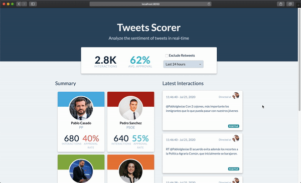
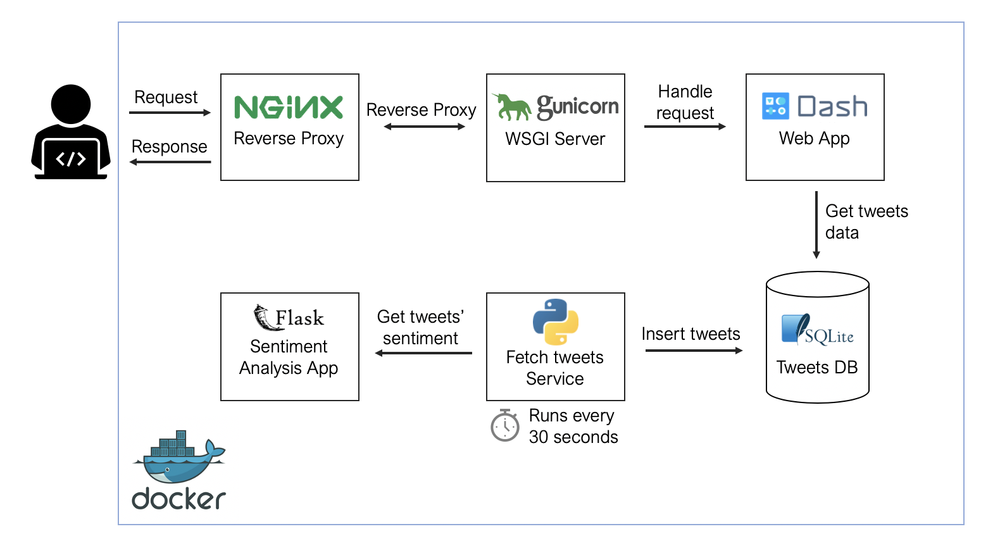
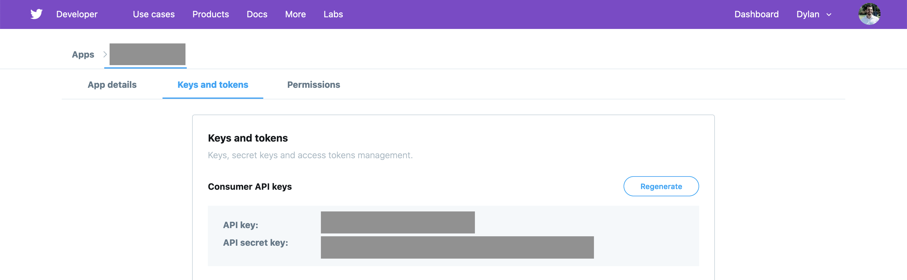

# Track Sentiment on Twitter in Real-time

  

This repository contains the source code and resources for building a web app that tracks the sentiment on twitter towards set of pre-specified accounts. Esssentially, it is a leaner version of [polituits.com](https://polituits.com).

The end-product looks as follows:



# How it Works

The application provides you with (close to) real-time **tracking of the sentiment of comments and mentions towards a set of accounts**. For predicting the sentiment of comments it uses a combination of fixed rules and a classifier built with the language model [BERT](<https://en.wikipedia.org/wiki/BERT_(language_model)>).

Just to make it clearer, the app doesn't track the sentiment of the comments made by the accounts you defined. **It tracks the sentiment of the responses and mentions received by those accounts.**

The architecture of the app looks as follows:



It comprises the following elements:

- **NGINX** as a reverse proxy server
- **Gunicorn** as a WSGI server
- A **Dash** application for visualizing results
- Processed tweets are store in a **SQlite3** database
- Two additional **services** for getting, processing, and assigning sentiment to tweets

# How to add accounts to track

If you want to build your own app to track sentiment toward a specific set of accounts, there are things three you'll need to do first: set the required environment variables, define which accounts you want to track, and provide the model's artifacts.

## Set environment variables

Start by setting up a [Twitter Developer account](https://developer.twitter.com/en), create an App, and generate consumer keys for your App. In case you're wondering, this is entirely free. You just need to fill out some questions.

Then, create an `.env` file in the `fetcher/` directory. It should contain these variables:

```
TWITTER_KEY=COPY_YOUR_API_KEY_HERE
TWITTER_SECRET=COPY_YOUR_API_SECRET_KEY_HERE
SENTIMENT_APP_HOST=localhost
FETCH_INTERVAL=30
LANGUAGE=es
```

You can get the values for `TWITTER_KEY` and `TWITTER_SECRET` from your App's details in your developer account:



For `SENTIMENT_APP_HOST` use `sentiment_app` if you are testing or deployig the app using _docker-compose_. If you are doing tests in a python virtual environment in your _local machine_, put `localhost` there.

`FETCH_INTERVAL` defines how frequently, in seconds, you make requests to the Twitter API to get the latest tweets. Make sure to read the [rate limits](https://developer.twitter.com/en/docs/tweets/search/api-reference/get-search-tweets) you should respect. The general recommendation is not to have many accounts and not updating that

## Define Accounts to Track

To define which accounts you want to track you need to update the `./data/accounts.csv` file. This will feed a query to the Twitter API that gets the mentions and responses that those accounts get. There's some _smart filters_ to avoid getting mentions or responses that are note relevant.

The `accounts.csv` file have the following fields:

- **id:** Identifier of the account (can be anything, just needs to be unique)
- **account:** Twitter handle you are interested in tracking
- **name:** Name that is displayed in the summary cards
- **image:** Image displayed in the summary cards and the latest tweets section
- **color:** Color associated with that account, it is shown at the top of the sumamry card
- **party:** Political party associated to the account you want to track. Leave it empty if it isn't relevant.

## Bring Your Own Model

You'll probably want to use a different model than the one I used. It shouldn't be that hard to add one. You need to provide the following things:

- A vocabulary file (vocab.txt) for the tokenizer
- A pre-trained BERT model from hugginface's repository
- The model's learned parameters to load using `load_state_dict()`
- An updated `emojis_dict.csv` file if you are planning on keeping that in the tweet processing pipeline

For training the model, I suggest the following [repository](https://github.com/abhishekkrthakur/bert-sentiment) and [tutorial](https://www.youtube.com/watch?v=hinZO--TEk4) by Abhishek Thakur.

Make sure to use the same pre-processing steps used in `process_text(column)` in `fetch_tweets.py` if you build a dataset for training your model. Adjust them if neccessary.

Once you have these, save the `vocab.txt` and the model's learned parameters files in `sentiment_app/input/` directory. Then, you need to update the `config.py` file in `sentment_app/`:

```
MAX_LEN = 256
PREDICT_BATCH_SIZE = 32
NUM_WORKERS = 4
MODEL_PATH = "./input/model.bin" # Replace by your file with the learned parameters
BERT_MODEL = "dccuchile/bert-base-spanish-wwm-uncased" # Replace by pre-trained BERT from HugginFace's models
TOKENIZER = transformers.BertTokenizerFast.from_pretrained(
"./input/", do_lower_case=True, truncation=True
)
```

Save the updated `emojis_dict.csv` in the `data/` directory.

# How to Deploy

First, make sure you've set everything from the [previous section](#how-to-add-accounts-to-track). In addition, there are a few things you need to have in place in your VPS:

- [Python 3.8](https://gist.github.com/plembo/6bc141a150cff0369574ce0b0a92f5e7#file-deadsnakes-python38-ubuntu-bionic-md)
- [Docker](https://www.digitalocean.com/community/tutorials/how-to-install-and-use-docker-on-ubuntu-18-04) and [docker-compose](https://www.digitalocean.com/community/tutorials/how-to-install-docker-compose-on-ubuntu-18-04)

After installing Python 3.8, Docker, and docker-compose, you can continue as follows:

1. Start by cloning the repository: `

2. Open a terminal at the root directory of your project and create the Tweets database as follows:

   ```shell
   $ cd utils
   $ python3 create_database.py
   ```

3. Create an `.env` file with the [required variables](#set-environment-variables)

4. Update the `accounts.csv` file with [accounts you want to track](#define-accounts-to-track).

5. Setup your [model](#bring-your-own-model)

6. Add the server name to the NGINX config file

   ```conf

   server {

       listen 80;
       server_name REPLACE_BY_DOMAIN_OR_IP;

       charset utf-8;

       location / {
           proxy_pass http://dash_app:8050;

           # Do not change this
           proxy_set_header Host $host;
           proxy_set_header X-Forwarded-For $proxy_add_x_forwarded_for;
           proxy_set_header X-Forwarded-Proto $scheme;
           proxy_set_header X-Real-IP $remote_addr;
       }

   }

   ```

7. Run `sh run-docker-sh` in the your root directory of your project

8. That's all! You're LIVE now!

# Limitations

- The model I trained is not great. If you want high-quality results make sure to dedicate some time to this. Ideally, build your own dataset.
- If you choose to track a very popular account, the application might not be able to do it at a proper pace. I do not paginate results from the API, so at most the last 100 results from whatever fetch interval you decide to use.
- The fetcher tries to get tweets in the interval you defined. However, if it takes too much time to process the tweets, it will not guarantee that it works with that frequency.
- I didn't add how to generate a SSL certificate here. But there are plenty of resources on how to do that available.
- For local development I was using Python virtual environments, I only used Docker for deploying the application.
- Finally, this was just a project I did for fun. I just added a couple of tests for the fetcher. So expect bugs.
